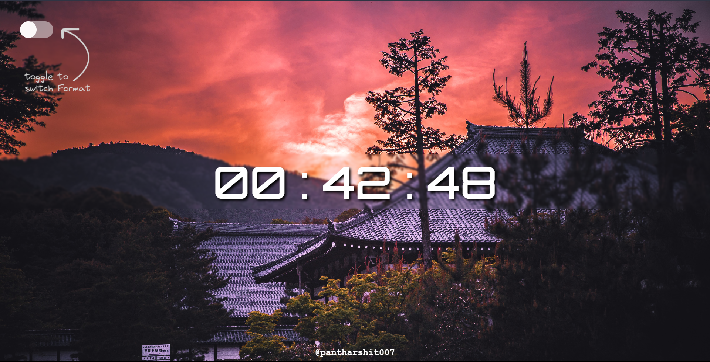
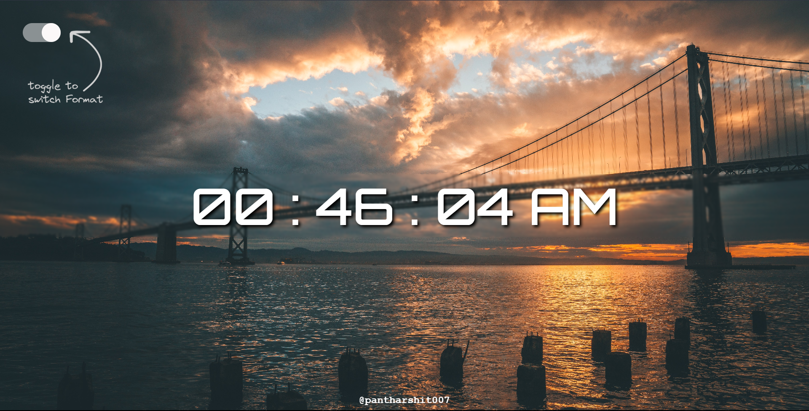

# Live Clock

This is a simple web application that displays a live clock with the ability to toggle between 12-hour and 24-hour time formats. The project features a clean and minimalist design with a toggle button for user interaction.

## Features

- **Live Clock**: Real-time clock display with continuous updates.
- **Format Toggle**: Switch between 12-hour and 24-hour time formats.
- **Toggle Animation**: Smooth transition animation when toggling between formats.
- **Responsive Design**: The clock is designed to be responsive and work well on various devices.

## Screenshots

## Getting Started

To view the live clock, simply visit the [deployment link](https://liveclock007.onrender.com/) in your web browser.

## Usage

- Toggle Button: Click on the toggle button to switch between 12-hour and 24-hour formats.
- Clock Display: The main area displays the current time in the chosen format.

## Installation

1. Clone the repository: `git clone https://github.com/pantharshit007/LiveClock.git`
2. Open the `index.html` file in a web browser.

## Technologies Used

- HTML5
- CSS3
- JavaScript

## Contributing

Contributions are welcome! Feel free to submit bug reports or enhancement requests. Please follow the [contribution guidelines](CONTRIBUTING.md).

## License

This project is licensed under the MIT License - see the [LICENSE](LICENSE) file for details.

## Acknowledgments

- Thanks to [@pantharshit007](https://github.com/pantharshit007) for creating this Live Clock project.

---

## धन्यवाद्
